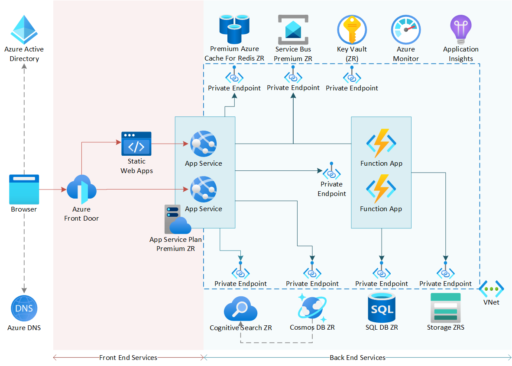

# Highly available zone-redundant web application

This sample contains a Bicep template that deploys a working example of the Azure architecture center reference architecture: [Highly available zone-redundant web application][hazrwebapp]. The reference architecture and sample show how to run a web-app workload on Azure App Services in a zone-redundant configuration. [Zone-redundant services][az-ha-services] provide high-availability by replicating your services and data across Availability zones to protect from single points of failure.



Availability zones spread a solution across multiple independent zones within a region, allowing for an application to continue functioning when one zone fails. Most foundational and mainstream Azure services, and many specialized Azure services provide support for availability zones today. 

All of the Azure services in this architecture are either always-available or zone-redundant services. Azure Front Door, Azure Active Directory (Azure AD), Azure DNS and Static Web Apps are always-available (non-regional) services, resilient to zone and region-wide outages. All other services are zone-redundant.

> For detailed information, recommendations and important considerations, see [Highly available zone-redundant web application][hazrwebapp] in the Azure Architecture Center.

## Prerequisites

* Azure Subscription with Contributor access
* Latest version of [AZ CLI][azcli], either installed locally or using [Azure Cloud Shell][cloudshell].

## Deployment Steps

### 1. Clone this repo.

```
git clone https://github.com/Azure-Samples/highly-available-zone-redundant-webapp.git
cd highly-available-zone-redundant-webapp
```

### 2. Create a resource group

```
az group create --name hazrwebapp-wus3-rg --location westus3
```

### 3. Create a deployment

Deploy the solution using the bicep template provided by creating a deployment.

```
az deployment group create --resource-group hazrwebapp-wus3-rg --template-file ./bicep/main.bicep
```

## Bicep parameters

`bicep/main.bicep` has several optional parameters that can be used to adjust deployment configuration. These can be passed inline with the `az deployment group create` command. For example:

```
az deployment group create --resource-group hazrwebapp-wus3-rg --template-file ./bicep/main.bicep --parameters staticWebAppLocation=westus2
```

| param | Description | Default value |
| -- | -- | -- |
| `applicationName` | Optional. A name that will be prepended to all deployed resources. | An alphanumeric id that is unique to the resource group. |
| `location` | Optional. The Azure region (location) to deploy to. Must be a region that supports availability zones. | Resource group location. |
| `staticWebAppsLocation` | Optional. The Azure region (location) to deploy Static Web Apps to. Even though Static Web Apps is a non-regional resource, a location must be chosen from a limited subset of regions. | The value of the `location` parameter, or the resource group location. |
| `tags` | Optional. An Azure tags object for tagging parent resources that support tags. | `{ Project: 'Azure highly-available zone-redundant web application' }` |
| `sqlAdmin` | 'Optional. SQL admin username. | `${applicationName}-admin` |
| `sqlAdminPassword` | Optional. A password for the Azure SQL server admin user. | A new GUID |
| `sqlDatabaseName` | Optional. Name of the SQL database to create. | `${applicationName}-sql-db` |
| `cosmosDatabaseName` | Optional. Name of the Cosmos database to create. | `${applicationName}-db` |
| `cosmosContainerName` | Optional. Name of the Cosmos DB container to create. | `Container1` |
| `cosmosPartitionKeys` | Optional. Array of properties that make up the Partition Key for the Cosmos DB container. | `[ 'id' ]` |
| `servicebusQueueName` | Optional. Name of the Service Bus queue to create | `Queue1` |
| `appServicePlanPremiumSku` | Optional. The version of App Service Premium SKU to deploy. Allowed values `PremiumV2` or `PremiumV3`. | `PremiumV3` |

## Instructions

View the deployed resources in the Azure Portal observing:

* App Service web apps and Function Apps created and ready for app deployment.
* Private endpoints configured and auto-approved for Azure Service Bus, Cosmos DB, Azure Cache for Redis, Functions, Key Vault, Storage, Azure Search and SQL DB.
* Managed system identities enabled and role assignments created (where available).
* Azure Front Door routing rules configured.

Configure continuous deployment pipelines to deploy applications into Azure App Service Web Apps and Function Apps.

## Cleanup

Delete the resource group to cleanup all resources:

```
az group delete --name hazrwebapp-wus3-rg --no-wait
```

## Azure Policies

This implementation doesn't provide any workload-level Azure Policies to govern the architecture. Consider adding policies where it makes sense to enforce specific topology decisions, functional, and/ or non-functional requirements. Also, this implementation assumes no interference with Azure Policies that you may have applied to your subscription or your subscription's management group(s).  If you have a policy related error during deployment, please check into what Azure Policies are being enforced at your scope and adjust the template accordingly.


## Resources

* [Highly available zone-redundant web application][hazrwebapp] reference architecture in the [Azure Architecture Center][aac].
* [Contributing guidelines](./CONTRIBUTING.md).

<!-- Links -->
[hazrwebapp]:https://learn.microsoft.com/azure/architecture/reference-architectures/app-service-web-app/zone-redundant
[aac]:https://learn.microsoft.com/azure/architecture/
[azcli]:https://learn.microsoft.com/cli/azure/install-azure-cli
[cloudshell]:https://learn.microsoft.com/azure/cloud-shell/overview
[az-ha-services]:https://docs.microsoft.com/azure/availability-zones/az-region#highly-available-services
